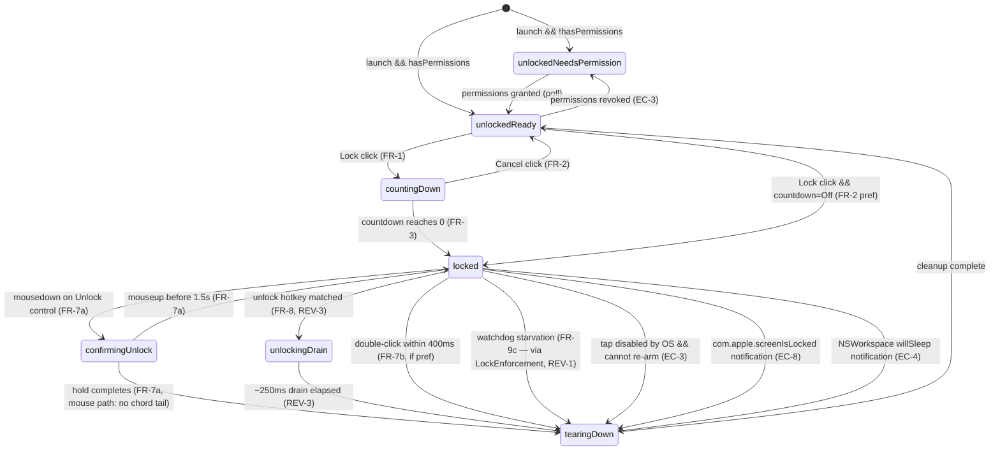

# KeyboardLock — Technical Specification

Engineering design for the macOS utility specified in [docs/PRD.md](./PRD.md). The PRD is the source of truth for **what** and **why**; this document defines **how**.

| Field | Value |
| --- | --- |
| Status | Draft v0.3 (REV-7 resolved by PM, Option B) |
| Last updated | 2026-05-28 |
| Spec author | Engineering (TBD) |
| PRD link | [docs/PRD.md](./PRD.md) |
| Review response | [docs/SPEC-REVIEW-RESPONSE.md](./SPEC-REVIEW-RESPONSE.md) |
| Target macOS | 13.0 Ventura and later (Apple Silicon + Intel, universal binary) |
| Language / UI | Swift 5.10+, SwiftUI for window content, AppKit for menu bar / floating panel / event tap glue |
| Toolchain | Xcode 16+, latest stable macOS SDK |
| Third-party deps | **None in v1.** No background-network dependency (no Sparkle in v1 — manual, mouse-driven update check only; see BUILD-5 and REV-4). |

---

## 1. Overview & Scope

KeyboardLock is a single-process, non-sandboxed macOS app that installs a `CGEventTap` at `kCGHIDEventTap` while the user is "cleaning mode," drops every keyboard event except one allow-listed unlock hotkey, and exposes a mouse-only floating UI to enter and exit that state. This spec covers the implementation of every functional requirement in the PRD (FR-1…FR-18, AX-1…AX-7) and addresses every limitation and edge case (L-1…L-6, EC-1…EC-13).

Goal mapping (PRD → spec):
- **G1** (one-click lock) → ARCH-3, UI-2.
- **G2** (all keyboards suppressed) → TAP-1…TAP-4.
- **G3** (≥2 unlock paths + fallback) → FSM-4, FSM-5, EDGE-1.
- **G4** (loud state) → UI-3, UI-7.
- **G5** (honest permissions) → PERM-1…PERM-5.
- **G6** (small single-purpose utility) → no daemon, no XPC helper, no network — see ARCH-1.

Non-goals (PRD NG1–NG6) are preserved: no trackpad/mouse lock, no parental controls, no scheduled lock, no MDM, no remote-input handling, no Windows/Linux.

---

## 2. Architecture

### 2.1 Process model (ARCH-1)
One process, no helpers in v1. The app runs as a regular foreground app (dock icon visible, has main window), plus an `NSStatusItem` in the menu bar. No XPC service, no `launchd` agent. Rationale: the kernel removes the event tap automatically when the process exits (EC-1), and the watchdog is in-process per **D-3** of the PRD.

> **Single instance (resolves SPEC-Q1 / REV-18).** On `applicationDidFinishLaunching`, the app checks `NSWorkspace.shared.runningApplications` for another running instance with the same bundle identifier (excluding self). If one is found, the new instance brings the existing one forward (`activate`) and calls `NSApp.terminate(nil)`. This prevents `open -n` or a double-launch from installing a second event tap that would fight the first. Enforced unconditionally; not user-configurable.
>
> **Interaction with the PERM-4 relaunch (REV-NEW-1).** The relaunch flow (REV-10) launches a fresh instance *before* the old one terminates, so for a moment two instances coexist — the naive single-instance check would make the fresh instance kill *itself*. Resolution: a sibling is treated as "already exiting" and ignored if it `isTerminated` or if the launching instance set a short-lived handoff marker in `UserDefaults` (`relaunchHandoffUntil` = now + 3 s). The fresh instance, seeing a valid handoff marker, skips the terminate-self branch and clears the marker. The old instance always wins the race to die; the new one always survives.

### 2.2 Components (ARCH-2)

| Component | Type | Responsibility | Lives on |
| --- | --- | --- | --- |
| `KeyboardLockApp` | `@main` SwiftUI `App` | Scene composition; owns the `AppEnvironment` | Main thread |
| `AppDelegate` | `NSApplicationDelegate` (via `NSApplicationDelegateAdaptor`) | `NSStatusItem` lifecycle; workspace + power notification observers; single-instance check; `LSUIElement` toggling | Main thread |
| `LockEnforcement` | `final class` wrapping `OSAllocatedUnfairLock`-protected fields + atomics | **Thread-safe source of truth for the *enforcement* facts** (tap installed? IOPM held? current `HotkeyBinding`?). Mutable from any thread. Owned by `LockController`. This is the store the watchdog touches (REV-1). | Any thread |
| `LockStateMachine` | `@MainActor ObservableObject` (final class) | Source of truth for *UI* state; publishes `@Published var state: LockState`. Reconciles against `LockEnforcement` whenever main wakes (REV-1, REV-11). Mutated only on main. | Main thread |
| `LockController` | Plain class | Owns the event tap + `LockEnforcement`; runs its `CFRunLoop` on a dedicated POSIX thread; allow/deny decisions on hotkey | Dedicated tap thread |
| `HotkeyMatcher` | Value type (`struct`) | Pure function from `(KeyEvent) -> Bool`; given a `HotkeyBinding`, decides match | Tap thread (called from C trampoline) |
| `PermissionsService` | `ObservableObject` | Polls + requests Accessibility and Input Monitoring; runs the tap-creation **probe** (REV-10); opens System Settings deep links | Main thread |
| `PowerManager` | Class | Creates and releases `IOPMAssertion` while locked (handle stored in `LockEnforcement` so the watchdog can release it off-main) | Main thread + watchdog queue |
| `Watchdog` | Class wrapping `DispatchSourceTimer` with an injected `Clock` + heartbeat source (REV-5) | Heartbeat receiver; on starvation, operates only on `LockEnforcement` (tap teardown + IOPM release) and posts a reconcile notification — never touches `@Published` / AppKit (REV-1, REV-11). | Dedicated background queue |
| `MenuBarController` | `NSObject` | `NSStatusItem` icon + menu; icon/pulse driven by a main-thread timer that reads the `LockEnforcement` atomic flag (REV-11); pulse respects Reduce Motion | Main thread |
| `PreferencesStore` | Class wrapping `UserDefaults` | Typed `@Published` accessors for persisted preferences; publishes `unlockHotkey` changes that `LockController` subscribes to (REV-9) | Main thread |
| `UnlockHotkeyRecorder` | SwiftUI view + AppKit local monitor | Records a chord into a `HotkeyBinding` (used only when *un*locked) | Main thread |

### 2.3 Component interaction diagram (ARCH-3)

```mermaid
flowchart TB
    subgraph MainThread["Main thread (UI + state)"]
        UI[SwiftUI Views\nMainWindow / Locked panel / Prefs]
        SM[LockStateMachine]
        Perms[PermissionsService]
        Power[PowerManager]
        Menu[MenuBarController]
        Prefs[(UserDefaults\nvia PreferencesStore)]
    end

    subgraph TapThread["Tap thread (CFRunLoop)"]
        Ctrl[LockController]
        Enf[(LockEnforcement\natomic / unfair-lock)]
        Tap{{CGEventTap\nkCGHIDEventTap}}
        Match[HotkeyMatcher]
    end

    subgraph WatchdogQ["Background queue"]
        WD[Watchdog\nDispatchSourceTimer]
    end

    HID([HID event stream]) --> Tap
    Tap -->|drop / passthrough| OS([WindowServer & frontmost app])
    Tap --> Match
    Match -->|matched hotkey| Ctrl
    Ctrl --> Enf
    Ctrl -->|"DispatchQueue.main.async\n(unlock requested)"| SM
    UI <--> SM
    SM <-->|enable / disable tap| Ctrl
    SM <-->|check / request / probe| Perms
    SM <-->|assert / release| Power
    SM <--> Menu
    SM <-->|read / write| Prefs
    SM -->|heartbeat every 1s while locked| WD
    Prefs -.->|Combine: unlockHotkey change\n(only when unlocked)| Ctrl
    WD -->|"on starvation: stop tap,\nrelease assertion, flip flag"| Enf
    WD -.->|"post .kbStateForcedUnlocked"| SM
    Menu -.->|reads atomic locked flag| Enf
    SM -.->|reconcile on wake| Enf
```

> **Watchdog never mutates `@Published` / AppKit off-main (REV-1, REV-11).** Dotted edges from `WD` are one-way signals: the watchdog writes `LockEnforcement` (tap down, IOPM released, `lockedFlag = false`) and posts `.kbStateForcedUnlocked`. The `@MainActor LockStateMachine` and the menu-bar icon reconcile against `LockEnforcement` when the main thread next runs. The keyboard is restored regardless of main-thread health; only the *visual* catch-up waits for main (see EDGE-1).

### 2.4 Threading rules (ARCH-4)
There are **two** sources of truth, split deliberately to avoid off-main mutation of `@Published` (REV-1):

1. **`LockEnforcement`** — the enforcement facts (`tapInstalled`, `iopmAssertionID`, `lockedFlag`, current `HotkeyBinding`). Backed by `OSAllocatedUnfairLock` for the binding and `os_unfair_lock`/`Atomic`-style storage for the boolean/handle fields. **Readable and writable from any thread.** This is what the tap thread and the watchdog touch.
2. **`LockState`** (the `@Published` UI enum on `@MainActor LockStateMachine`) — **only ever mutated on the main thread.**

Rules:
- All SwiftUI/AppKit work and every mutation of `LockState` happen on the main thread. `LockStateMachine` is `@MainActor`.
- The CGEventTap callback runs on the dedicated tap thread; it must never touch SwiftUI, Combine publishers, or `@Published` properties directly. It reads/writes only `LockEnforcement` and signals the main thread via `DispatchQueue.main.async`.
- The watchdog timer runs on its own serial queue (`com.itsbryantp.keyboardlock.watchdog`). On starvation it mutates **only `LockEnforcement`** (disable tap, release IOPM, set `lockedFlag = false`) and posts `Notification.Name.kbStateForcedUnlocked`. It does **not** set `@Published var state`, does **not** call AppKit window APIs, and does not hop to main (main is the suspect). The `@MainActor` mirror and the menu-bar icon reconcile against `LockEnforcement` the next time main runs (EDGE-1). This eliminates the "one exception" hand-wave in the v0.1 spec.

### 2.5 Dependency direction (ARCH-5)
Views depend on `LockStateMachine` (UI source of truth). `LockStateMachine` depends on `LockController`, `PermissionsService`, `PowerManager`, `PreferencesStore`, `Watchdog`, and reads `LockEnforcement` for reconciliation. `LockController` owns `LockEnforcement` and depends only on `HotkeyMatcher`, `PreferencesStore` (subscribed for binding updates, REV-9), and the C tap APIs. `Watchdog` depends only on `LockEnforcement` + an injected `Clock`/heartbeat source (REV-5). No reverse dependencies into `LockStateMachine`. This keeps `LockStateMachine` straightforward to unit test with mocks of its collaborators, and keeps the safety-critical teardown path (`Watchdog → LockEnforcement → tap`) free of any `@MainActor` coupling.

---

## 3. Lock/Unlock State Machine

### 3.1 States (FSM-1)

| ID | State | Meaning |
| --- | --- | --- |
| S0 | `unlockedReady` | Default. Permissions granted **and tap-creation probe passed** (REV-10). Tap not installed. Main window shows green status + Lock button. |
| S1 | `unlockedNeedsPermission` | App can run but cannot lock — either a permission is missing, **or** permissions report granted but the tap-creation probe failed (needs relaunch, REV-10). Window shows the relevant explainer/remediation + deep-link or "Restart Now" button. |
| S2 | `countingDown` | User clicked Lock; pre-lock countdown active (1/3/5 s per pref). Mouse-cancelable. |
| S3 | `locked` | Tap installed and dropping events. Floating panel shown. Watchdog heartbeating. Power assertion held. |
| S4 | `confirmingUnlock` | Locked + user holding the Unlock control. Visual progress ring filling. Substate of S3 for tap purposes (tap stays installed). |
| S5 | `unlockingDrain` | **(REV-3)** A matched unlock hotkey (or completed mouse hold via the hotkey path) was accepted; the tap is **kept installed and dropping ALL events** for a ~250 ms debounce window so the tail of the chord (`keyUp` for ⌃/⌥/⌘/letter) cannot leak to the frontmost app. On expiry → `tearingDown`. Mouse-hold unlock skips this state (no chord tail) and goes straight to `tearingDown`. |
| S6 | `tearingDown` | Transient state during tap removal / assertion release; ~100 ms. Prevents racing user clicks. |

`LockState` is modeled as a Swift `enum` with associated values where needed (`countingDown(remaining: TimeInterval)`, `confirmingUnlock(progress: Double)`, `unlockingDrain(deadline: ContinuousClock.Instant)`).

### 3.2 Transitions (FSM-2)



### 3.3 Idempotency (FSM-3)
- Lock requests are no-ops while `state ∈ {countingDown, locked, confirmingUnlock, unlockingDrain, tearingDown}` (EC-10).
- Unlock requests are no-ops while `state ∈ {unlockedReady, unlockedNeedsPermission, unlockingDrain, tearingDown}` (a second unlock trigger during the drain or teardown does nothing — the tap is already committed to coming down).
- All transitions funnel through `LockStateMachine.handle(_ event: Intent)` which serializes via `@MainActor`.

### 3.4 Hotkey unlock path (FSM-4) — drain-before-teardown (REV-3)
The v0.1 design was internally contradictory: it tore the tap down on the unlock transition yet claimed the matcher would "swallow the `keyUp` for 500 ms." Once the tap is gone there is nothing left to swallow, so the `keyUp` tail of the chord (`⌃`, `⌥`, `⌘`, and the letter) would reach the frontmost app — harmless for a release of ⌃⌥⌘L, but for a user-configured chord like ⌃⌥⌘S the stray `keyUp` can still trigger menu activation in some apps. Corrected flow:

1. Tap callback receives a `keyDown`. `HotkeyMatcher.matches(keyEvent, against: enforcement.binding)` returns `true`.
2. Callback consumes the event (returns `nil`) and dispatches `DispatchQueue.main.async { stateMachine.handle(.unlockRequestedByHotkey) }`.
3. Main thread transitions `locked → unlockingDrain(deadline: now + 250ms)`. **The tap stays installed and keeps returning `nil` for every event** (key down, key up, flags changed) for the entire drain window — the chord tail is swallowed because the tap is still alive, not because of any matcher state tracking.
4. A one-shot main-thread timer (`DispatchQueue.main.asyncAfter`) fires at the deadline and transitions `unlockingDrain → tearingDown`. `tearingDown` removes the tap, releases the IOPM assertion, then → `unlockedReady`.
5. If the main thread is hung during the drain so the deadline timer never fires, the watchdog still tears the tap down on starvation (FR-9c / EDGE-1) — the drain never strands the keyboard. The 250 ms window is well under the 5 s watchdog threshold.

Rationale for 250 ms: comfortably longer than the inter-event gap of a fast key release (tens of ms) yet imperceptible to the user. It is a fixed constant, not configurable.

### 3.5 Mouse-hold unlock path (FSM-5) — `HoldButton` is the committed design (REV-8)
The v0.1 "use HoldButton, fall back to SwiftUI gestures if problematic" hedge is removed. SwiftUI's `LongPressGesture` does not expose intermediate progress and `DragGesture(minimumDistance: 0)` + a timer has well-known hit-testing conflicts with buttons. We commit to a single design:

`HoldButton` is an `NSViewRepresentable` wrapping a custom `NSControl` subclass. Contract:

1. **State source.** The control owns `@Published var progress: Double` (0…1), surfaced to SwiftUI via an `ObservableObject` view-model bound into `confirmingUnlock(progress:)`.
2. **Press start.** `override func mouseDown(with:)` records the press start instant and begins a **60 Hz progress driver**. Use a `CVDisplayLink` (available on macOS 13; `CADisplayLink` is macOS 14+ and therefore NOT used given our 13.0 floor) or, if the display-link wiring proves heavy, a `DispatchSourceTimer` at ~16.6 ms — either way the driver updates `progress = elapsed / 1.5s` clamped to 1.0.
3. **Completion.** When `progress` reaches 1.0, the driver stops and the control sends `.unlockRequestedByMouse` (mouse path: skips `unlockingDrain`, goes straight to `tearingDown` — there is no chord tail to swallow). The control then animates a shrink + fade.
4. **Early release.** `override func mouseUp(with:)` before completion stops the driver and resets `progress = 0` (→ remains `locked`).
5. **Cursor-exit behavior (was unspecified — now defined).** `override func mouseDragged(with:)` tracks the cursor. If the cursor leaves the button's bounds **inset by an 8 pt hysteresis margin**, the hold **cancels** (driver stops, `progress = 0`, state stays `locked`) exactly as an early release would. Re-entering the bounds does NOT auto-resume — the user must press again. Rationale: a cleaning cloth dragging off the control should *cancel*, never complete; cancel-on-exit is the safe failure direction and matches standard `NSButton` drag-out semantics.
6. **AppKit teardown.** `mouseExited`/window-resign also cancel, so a hold can never be "left running" when the panel loses the press.

### 3.6 Safety fallback path (FSM-6)
Force Quit is OS-level and not modeled in the state machine. The watchdog (FR-9c) IS modeled — it forces a transition to `tearingDown` from any sub-state of `locked` if heartbeats are missed.

---

## 4. Event Interception Design

### 4.1 Tap placement (TAP-1)
- **Where:** `tap = .cghidEventTap` (lowest user-space level — sees events before WindowServer and any other tap).
- **Placement in chain:** `place = .headInsertEventTap` (we run before any other taps already installed by users' utilities).
- **Options:** `.defaultTap` (active tap that can modify/drop events). A `.listenOnly` tap cannot drop, which is required by FR-3.
- **Run loop:** dedicated thread (`Thread { ... }`), creating its own `CFRunLoop`, with the tap's `CFRunLoopSource` added in `.commonModes`. The tap is enabled only while transitioning into S3 (`locked`).

### 4.2 Event mask (TAP-2)
```swift
let mask: CGEventMask =
      (1 << CGEventType.keyDown.rawValue)
    | (1 << CGEventType.keyUp.rawValue)
    | (1 << CGEventType.flagsChanged.rawValue)
    | (1 << CGEventType.systemDefined.rawValue) // media / brightness, where interceptable
```
Mouse events are deliberately not in the mask — mouse must keep working (FR-7).

### 4.3 Callback contract (TAP-3)
The callback is a C function (because `CGEvent.tapCreate` takes a C function pointer). It receives a `refcon` set to `Unmanaged.passUnretained(controller).toOpaque()`. The callback:

1. If `type == .tapDisabledByTimeout`: **re-enable the tap immediately on this same callback invocation** (`CGEvent.tapEnable(tap: port, enable: true)` — Apple's recommended pattern, and the tap thread is exactly where it is cheapest), bump the consecutive-disable counter in `LockEnforcement`, and return `nil` (the disabling event is itself dropped). Only if re-enable fails or the counter trips the cap does the callback dispatch `.tapInterrupted` to main for a transition to `unlockedReady` (TAP-5). If `type == .tapDisabledByUserInput`: dispatch `.tapInterrupted` to main and return `nil` (TAP-5).
2. If `type == .systemDefined` and the event is NOT a known media-key subtype, return it unchanged. We only want to drop the keyboard-relevant subset.
3. Build a lightweight `KeyEvent` value (keycode, flags, type) and call `HotkeyMatcher.matches`. If it matches:
   - Dispatch `unlockRequestedByHotkey` to main.
   - Return `nil` (consume).
4. Otherwise: return `nil` (consume — FR-3, FR-5, FR-6).

The callback must be allocation-free in the hot path. `HotkeyMatcher.matches` is a value-type method on a stack-allocated struct read from a `_AtomicLockState` (see TAP-6) — no Swift `Dictionary`/`String` work, no Obj-C bridging.

### 4.4 Single-hotkey allow-through (TAP-4)
A `HotkeyBinding` is `{ keyCode: CGKeyCode, requiredFlags: CGEventFlags }`. The comparison mask **deliberately excludes `.maskSecondaryFn` (REV-12)**:

```
// fn is NOT part of the comparison: it is masked OUT of both sides.
let CHORD_MASK: CGEventFlags = [.maskShift, .maskControl, .maskAlternate, .maskCommand]
let flags = event.flags.intersection(CHORD_MASK)
return event.getIntegerValueField(.keyboardEventKeycode) == binding.keyCode
    && flags == binding.requiredFlags
```

Why exclude `fn` (REV-12): if `.maskSecondaryFn` were part of the comparison, a user who recorded ⌃⌥⌘L without `fn` and then rested a finger on the `fn`/globe key during cleaning would produce `flags != requiredFlags`, and the unlock would **silently no-op** — a serious foot-gun, especially on Macs where the globe key is remapped to `fn`. By masking `fn` out of both the stored binding and the live comparison, unlock fires whether or not `fn` happens to be held. The recorder (UI-8) correspondingly strips `fn` from any recorded chord, so a binding can never *require* `fn`.

We also mask off device-dependent flags (numeric keypad, caps-lock latch) before comparing, so the chord matches regardless of which physical key produced the modifier. FR-8b is enforced at the *recorder* level (the UI rejects bindings with zero required-modifier bits among ⌃/⌥/⌘/⇧); the matcher just compares. Note this still satisfies PRD FR-5 (fn is *suppressed* as a keystroke while locked — every non-matching event including fn-bearing ones is dropped); excluding fn only affects whether it can be part of the *unlock* chord.

### 4.5 Re-arming after OS disable (TAP-5) — zero-leak contract (REV-6)
macOS will disable a tap whose callback exceeds the latency budget (~30 ms) or that hits other conditions. For a safety-critical app the target is **"zero keys leak,"** not "occasional bursts," so the gap between disable and re-enable must be made as small as the platform allows:

On `kCGEventTapDisabledByTimeout`:
1. **Re-enable on the same callback invocation, on the tap thread** (`CGEvent.tapEnable(enable: true)`), per TAP-3 step 1. This is the tightest possible loop — there is no hop to another queue, so no scheduler latency is added to the gap. The disabling event itself is dropped (`return nil`).
2. **Make timeouts rare in the first place** by keeping the hot path within budget: the callback does no heap allocation, no Swift `String`/`Dictionary` work, no Obj-C bridging, no logging; it reads the binding from the `OSAllocatedUnfairLock` snapshot and runs the fixed-cost integer comparison in TAP-4. This is a hard requirement, verified by a perf assertion in TEST-I3.
3. **Surface the gap in the UI.** On the first timeout in a session, flip a `LockEnforcement.rearming` flag; the floating panel shows a transient "Re-arming…" pill (UI-7) so the user knows not to type for that instant. The flag clears on the next successful event pass-through-as-drop.
4. **Bound the failure.** Count consecutive disables in `LockEnforcement`. If `>= 3` within 10 s, or if `tapEnable` returns without the tap becoming active, give up: dispatch `.tapInterrupted` → `tearingDown` → `unlockedReady` with a banner: "The keyboard lock was interrupted by macOS. Please try again." (Mapping: EC-3.)

We do **not** promise that a single timeout leaks zero events — the disabling event and any in-flight event between disable and the synchronous re-enable may pass — but by re-enabling synchronously on the tap thread the window is one callback wide, and the "Re-arming…" pill makes it honest rather than silent.

On `kCGEventTapDisabledByUserInput` (e.g., the user removed the app's Accessibility privilege mid-session): no re-enable is attempted; dispatch `.tapInterrupted` → immediate transition to `unlockedReady`, surface a banner pointing at System Settings (PERM-5).

### 4.6 Atomic snapshot for the binding (TAP-6) — explicit update flow (REV-9)
The tap thread reads the current `HotkeyBinding` on every keystroke; the main thread writes it when the user changes preferences. The binding lives in an `OSAllocatedUnfairLock<HotkeyBinding>` field of `LockEnforcement` (macOS 13+). The hot path takes the lock for a single struct copy; the write side is rare (only on preference change while *un*locked), so contention is non-existent in practice.

The producer → consumer wiring (was ambiguous between "publishes a snapshot" and "held in a lock" — who calls whom):

1. `PreferencesStore.unlockHotkey` is an `@Published var HotkeyBinding` on the main-thread store.
2. `LockController.init(prefs:stateMachine:)` subscribes to `prefs.$unlockHotkey` via Combine, delivering on a dedicated serial queue (`com.itsbryantp.keyboardlock.binding`), and **also** sets the initial value synchronously at init.
3. Inside the subscription handler, the controller **enforces the FR-8a invariant**: it reads `stateMachine.isUnlocked` (a thread-safe snapshot mirrored into `LockEnforcement`); if the state is anything other than `unlockedReady`/`unlockedNeedsPermission` it asserts in debug and early-returns in release (a binding change must never land mid-lock). Otherwise it writes the new binding through `LockEnforcement`'s `OSAllocatedUnfairLock`.
4. The recorder UI (UI-8) is only interactive while unlocked, so under normal operation the guard in step 3 is belt-and-suspenders, not the primary enforcement.

No reverse call exists: `PreferencesStore` never references `LockController`. The single direction is `Prefs → (Combine) → LockController → LockEnforcement`.

### 4.7 Synthesized event handling (TAP-7)
Events posted by other taps (e.g., from accessibility tools synthesizing input) carry `event.getIntegerValueField(.eventSourceUserData) != 0` or a non-HID source state. We **drop all of them** while locked, including synthesized ones — the contract is "no keystrokes reach apps," not "no human keystrokes." Voice Control and Switch Control do NOT route through this tap (they use AX APIs), so they remain functional — see EDGE-12.

### 4.8 What we do NOT intercept (TAP-8)
Explicitly out of scope for the tap, documented in the in-app Help sheet:
- Physical power button long-press (hardware path, below HID tap — L-3).
- Touch ID sensor presses (separate secure path — L-3).
- Some brightness/keyboard-backlight keys on certain Macs (firmware-handled — L-3).
- Any keys typed into a frontmost app that has `EnableSecureEventInput` active (L-1). Before locking, we call `IsSecureEventInputEnabled()` and warn (UI-9).

> **⌥⌘Esc (Force Quit chord) while locked — RESOLVED (REV-7; PM accepted Option B 2026-05-28).** Our tap sits at `kCGHIDEventTap`, upstream of WindowServer, so while locked it consumes ⌥⌘Esc before the OS sees it. PM ruled that this is the intended behavior: **PRD FR-9a was amended** to document ⌥⌘Esc as NOT reachable while locked, preserving FR-6's blanket-suppression contract. The supported, mouse-only Force Quit path is the Apple-menu flow (UI-9, FR-9), which is unaffected. The matcher therefore has **no special-case allowlist for ⌥⌘Esc** — it is dropped like any other chord. The first-run explainer and the "Stuck?" sheet (UI-9) state the keyboard-invoked path is unavailable so users are not surprised.

---

## 5. Permissions & Entitlements

### 5.1 Required permissions at runtime (PERM-1)

| Permission | Check API | Prompt API | Settings deep-link |
| --- | --- | --- | --- |
| Accessibility | `AXIsProcessTrustedWithOptions([kAXTrustedCheckOptionPrompt: false])` | `AXIsProcessTrustedWithOptions([kAXTrustedCheckOptionPrompt: true])` | `x-apple.systempreferences:com.apple.preference.security?Privacy_Accessibility` |
| Input Monitoring | `IOHIDCheckAccess(kIOHIDRequestTypeListenEvent)` | `IOHIDRequestAccess(kIOHIDRequestTypeListenEvent)` | `x-apple.systempreferences:com.apple.preference.security?Privacy_ListenEvent` |

These prompts only fire the first time per app installation. After that, the user must visit System Settings to grant/revoke. We open the deep link via `NSWorkspace.shared.open(URL(...))`.

### 5.2 Info.plist (PERM-2)
- `LSMinimumSystemVersion = 13.0`.
- `LSApplicationCategoryType = public.app-category.utilities`.
- `NSHumanReadableCopyright`.
- `CFBundleShortVersionString`, `CFBundleVersion` (auto-bumped by CI).
- `LSUIElement = NO` in v1 (regular dock-visible app). If user research shows users prefer "menu-bar-only," flip this in v1.1.
- No purpose-string keys are required for Accessibility or Input Monitoring (unlike camera/mic). The OS prompt uses a generic string when the API is called.
- `NSAppTransportSecurity` not relevant (no networking in v1).

### 5.3 Entitlements (PERM-3)
- `com.apple.security.app-sandbox = false` (a sandbox-enabled build cannot install a tap at `kCGHIDEventTap` for arbitrary events — L-6).
- Hardened Runtime is **enabled** (required for notarization). Specifically:
  - `com.apple.security.cs.allow-jit = false`
  - `com.apple.security.cs.allow-unsigned-executable-memory = false`
  - `com.apple.security.cs.disable-library-validation = false`
- No other entitlements are required for the event tap once Accessibility + Input Monitoring are granted at runtime.

### 5.4 First-run flow (PERM-4)
Maps to FR-16, FR-17, FR-18.

1. On launch, `PermissionsService` performs a silent check (`AXIsProcessTrustedWithOptions(prompt: false)` and `IOHIDCheckAccess`).
2. **Tap-creation probe (REV-10).** A silent `AXIsProcessTrusted == true` is *necessary but not sufficient*: macOS frequently requires the app to be **relaunched** after Accessibility is first granted before `CGEventTap` creation actually succeeds. So when the silent check reports granted, `PermissionsService` immediately runs a probe: `CGEvent.tapCreate(...)` at `.cghidEventTap` with a no-op callback and a `.listenOnly` option, then — on success — `CGEvent.tapEnable(enable: false)` and `CFMachPortInvalidate(...)` to tear it straight back down. The probe installs and removes a throwaway tap; it does not start a run loop.
   - **Probe passes →** `unlockedReady`.
   - **Probe fails (granted-but-not-yet-effective) →** `unlockedNeedsPermission` with a distinct "Restart to finish setup" remediation variant (not the missing-permission variant): copy "Accessibility is granted but macOS needs KeyboardLock to restart before it can lock the keyboard," plus a **"Restart Now"** button that calls `NSWorkspace.shared.openApplication(at: Bundle.main.bundleURL, configuration: .init())` (which launches a fresh instance — the single-instance check in ARCH-1 hands off) and then `NSApp.terminate(nil)`. No launch agent is needed.
3. If either permission is missing outright → `unlockedNeedsPermission` (missing-permission variant). The `PermissionExplainerView` shows:
   - Two-step list (Accessibility, Input Monitoring) with check / cross status indicators.
   - One "Open System Settings" button per missing permission that opens the deep link.
   - A "Re-check" button that re-runs the silent check **and the probe** (also called automatically on `NSApplication.didBecomeActiveNotification`, so most users will not need to click it).
4. While in `unlockedNeedsPermission`, the Lock button is disabled with a tooltip explaining why (FR-18).
5. A repeating poll every 2 s also re-checks (check + probe) while the explainer is visible, so transitions feel instant after the user returns from System Settings.

### 5.5 Mid-session revocation (PERM-5)
Maps to EC-3. While locked, we listen for `NSWorkspace.didDeactivateApplicationNotification` (to know when we're foregrounded again later) and we trust the tap callbacks: a revocation manifests as `tapDisabledByUserInput` (TAP-5), which collapses us to `unlockedReady` with a remediation banner.

### 5.6 What we do NOT request (PERM-6)
- No camera, microphone, contacts, photos, location, files, full disk access, automation, AppleEvents, or network entitlements in v1. This is a load-bearing privacy claim used in the first-run explainer copy (PRD §6.5).

---

## 6. UI Specification

### 6.1 Scene inventory (UI-1)

| ID | Scene | Type | Visibility |
| --- | --- | --- | --- |
| W1 | Main window (unlocked) | SwiftUI `WindowGroup` | Open at launch; can be closed without quitting (app continues with menu bar). |
| W2 | Locked floating panel | `NSPanel` (backed by `NSWindow` with `.floating` level), SwiftUI content | Visible only in `locked` / `confirmingUnlock`. Replaces W1's content area; W1 may be hidden. |
| W3 | Preferences | SwiftUI `Settings` scene | Opened from menu bar, footer gear, or main menu. |
| W4 | First-run permission explainer | Embedded in W1 when state == `unlockedNeedsPermission` | Replaces W1's main content. |
| W5 | "Stuck?" sheet | SwiftUI `.sheet` on W2 | Opened from `?` in the locked panel. |
| M1 | Menu bar item | `NSStatusItem` | Always present (default), toggleable in prefs. |

We use `NSPanel` for W2 specifically because:
- It can have `.floating` window level (FR-14).
- It does not deactivate the previously active app (so the user's app keeps focus and they can keep mousing around).
- It supports a custom title bar / accessory view without fighting SwiftUI's window styling.

### 6.2 Unlocked window layout (UI-2)
Maps to PRD §5.2 and FR-11.

- Content frame: 420×320 pt, non-resizable, centered on the screen of the cursor.
- Top (44 pt): centered app icon (NSImage `NSApp.applicationIconImage`) + wordmark "KeyboardLock" (large title font).
- Middle (60 pt): green `Circle` (12 pt, `.systemGreen`) + bold "Keyboard is active" (title3, leading-aligned in HStack).
- Center (96 pt): `Button { stateMachine.handle(.lockRequested) } label: { ... }` — minimum 200×56 pt, accent color, SF Symbol `lock.fill` + "Lock Keyboard".
- Subtext (32 pt): "Locks all keyboard input so you can clean. Unlock with **⌃⌥⌘L** or the on-screen button." Uses `Text` with inline `Text("⌃⌥⌘L").monospaced()` and reflects the *current* binding (not literally ⌃⌥⌘L) by binding to `prefs.unlockHotkey.displayString`.
- Footer (44 pt): gear button (opens W3) + question-mark button (opens "About / Safety fallback" — same content as the Stuck? sheet for discoverability).

### 6.3 Locked panel layout (UI-3)
Maps to PRD §5.4 and FR-12, FR-14, FR-15.

- `NSPanel` with `level = .floating`, `styleMask = [.titled, .nonactivatingPanel]`, `collectionBehavior = [.canJoinAllSpaces, .stationary]` so the panel follows the user across Spaces and stays put across full-screen apps.
- Frame: 480×360 pt; movable by title bar (PRD §5.4 — "draggable").
- Background: amber-red tint applied via a SwiftUI `Color(red: 0.93, green: 0.20, blue: 0.20).opacity(0.10)` overlay; respects `accessibilityShouldIncreaseContrast` by deepening to opacity 0.20 and adding a 1 pt accent border.
- Status row: red `Circle` (16 pt, `.systemRed`) + bold "Keyboard is locked — safe to clean".
- Timer row: monospaced digits, `"Locked for \(formattedDuration)"`. Updates every 1 s via `Timer.publish`.
- Hold-to-unlock control: 320×96 pt `HoldButton` (FSM-5) showing label "Hold to Unlock" and an `Arc` overlay that fills 0→360° in 1.5 s while pressed, with cursor-exit cancel per FSM-5. On completion, shrinks + fades out → state machine transitions.
- "Re-arming…" pill (REV-6): a small amber pill that appears in the status row only while `LockEnforcement.rearming` is set after a `tapDisabledByTimeout` (TAP-5). Hidden in the normal case.
- Hotkey hint: "Or press **⌃⌥⌘L** on your keyboard." (binds to current `prefs.unlockHotkey.displayString`).
- `?` button bottom-right: opens "Stuck?" sheet.

> **Prototype the non-activating panel + `HoldButton` first (REV-17).** The combination of `[.titled, .nonactivatingPanel]` (so the panel never steals focus from the user's app) with a `HoldButton` `NSControl` that must receive `mouseDown`/`mouseDragged`/`mouseUp` is the single riskiest UI interaction in the app. Build a throwaway prototype of *exactly this configuration* before any other UI work: a non-activating floating `NSPanel` hosting the `HoldButton`, and confirm the press/drag/release cycle fires while another app holds key focus. **Fallback if it doesn't:** use a regular `NSWindow` at `.floating` level with `canBecomeKey`/`becomesKey` overridden to `false`, which still avoids focus theft but routes mouse tracking more conventionally. Pick whichever passes the prototype; record the choice in code comments. This replaces SPEC-A2's open-endedness with a concrete de-risking step.

### 6.4 Pre-lock countdown (UI-4)
Maps to PRD §5.3 and FR-2.

- Replaces only the central Lock button (UI-2 center) with a `Circle().trim(...)` progress ring + countdown number ("3", "2", "1").
- **Transitional accent (REV-20):** the countdown ring and headline use a distinct **system blue** accent — NOT a green→amber gradient between the two endpoint colors, which reads ambiguously as "almost locked / almost unlocked." A bold headline "Locking in 3…" (counting down 3→2→1) sits above the ring. Per FR-10, the transitional state must be visually distinct from *both* Unlocked (green) and Locked (red/amber); a third hue + an explicit verb headline achieves that.
- Cancel button is placed directly under the ring; activated by single mouse click (no hold) since accidental cancel just delays the lock — not a safety issue.
- If preferences set countdown to `Off`, this state is skipped and the transition is `unlockedReady → locked` directly (FSM-2 alt path).

### 6.5 Menu bar item (UI-5)
Maps to PRD §5.6 and FR-13, FR-15.

- Icon: monochrome SF Symbol template image. `keyboard` (24 pt) for unlocked, `keyboard.badge.ellipsis` or `keyboard.fill` with a lock badge (custom composite) for locked. The exact symbol may need a custom asset; recommendation: use `lock.fill` overlaid on `keyboard` via a compositing `NSImage`.
- **Icon is driven by `LockEnforcement`, not `@Published` (REV-11).** The `MenuBarController` runs a lightweight main-thread repeating timer (250 ms) that reads `LockEnforcement.lockedFlag` and updates the icon/pulse. This is why a watchdog-forced unlock (which sets `lockedFlag = false` off-main, EDGE-1) flips the icon back to "unlocked" as soon as the main thread is alive again — without the watchdog ever touching AppKit. In the normal path the state machine also requests an immediate refresh so there is no 250 ms lag.
- Pulse animation while locked: 2 Hz alpha 0.6↔1.0 via Core Animation on the `NSStatusBarButton.image`. Disabled if `NSWorkspace.shared.accessibilityDisplayShouldReduceMotion` is true (AX-5).
- Menu (built with `NSMenu`):
  - "Keyboard: Active" / "Keyboard: Locked (1:14)" header item (disabled, informational).
  - **"Lock Keyboard"** when unlocked → state machine `.lockRequested`.
  - **"Unlock Keyboard" when locked does NOT unlock directly (REV-2).** A plain menu item would defeat PRD FR-7's accidental-unlock safeguard (two stray mouse interactions — cloth opens the menu, a second drag selects the item — would end the lock with no hold/double-click gate). Instead, selecting "Unlock Keyboard" while locked **surfaces and focuses the floating panel's `HoldButton`**: it calls `panel.makeKeyAndOrderFront(nil)`, brings the panel to the cursor's screen, and pulses the hold control once to draw the eye. The actual unlock still requires the FR-7 hold (or double-click) on the panel. This keeps the FR-13-enumerated "Unlock Keyboard" item present while routing through the safeguard rather than bypassing it. `NSMenu` cannot host a hold-gesture well, so routing-to-panel (reviewer option a) is the chosen mechanism.
  - Separator.
  - "Show Main Window" → `NSApp.activate(ignoringOtherApps: true); mainWindow.makeKeyAndOrderFront(nil)`.
  - "Preferences…" → opens `Settings` scene.
  - "About KeyboardLock" → standard about panel.
  - Separator.
  - "Quit KeyboardLock" → `NSApp.terminate(nil)`. (Note: while locked, terminating drops the tap — confirms EC-1.)

> **"Show menu bar icon" preference vs FR-13/FR-15 — decided, not deferred (REV-14, resolves SPEC-PRDGAP2).** The preference may hide the menu bar item. When it is hidden, the locked-state visual contract is carried **entirely by the always-on-top floating panel** (W2), which is shown for the full duration of every lock session and is itself a loud, redundant-cue signal (red dot + amber tint + text + hold control). We explicitly accept, in writing, that hiding the menu bar item is **subtractive of one safety signal** — specifically the FR-15 pulse that aids discovery when the panel is occluded on a multi-monitor setup. The trade-off is acceptable because (a) the panel is `.floating` and cannot be occluded by a normal background click (FR-14), and (b) the user opted out deliberately. FR-13's "reflect state at all times" is therefore read as **conditional on the menu bar item being enabled.** A matching one-line PRD clarification is requested (see SPEC-REVIEW-RESPONSE.md); the spec does not block on it.

### 6.6 Preferences (UI-6)
Maps to PRD §5.7. SwiftUI `Settings` scene with a `TabView`:

| Tab | Controls | Binding |
| --- | --- | --- |
| General | "Launch at login" checkbox; "Show menu bar icon" checkbox; "Pre-lock countdown" segmented control (Off / 1s / 3s / 5s; default 3s per D-2) — see deviation note below | `PreferencesStore` |
| Unlock | "Unlock confirmation" radio (Hold 1.5s [default] / Double-click 400ms); "Unlock hotkey" recorder (UI-8) + "Reset to default" button (defaults to ⌃⌥⌘L, key code 37) | `PreferencesStore` |
| About | Version (CFBundleShortVersionString + build), link to GitHub repo, "Quit KeyboardLock" button | static |

Launch-at-login uses `SMAppService.mainApp.register()` / `.unregister()`.

> **Deviation from PRD FR-2 — countdown control (REV-16).** PRD FR-2 specifies the countdown is "skippable via a checkbox" (binary on/off, fixed 3 s). This spec uses a 4-way segmented control (Off / 1s / 3s / 5s) instead, which is a superset: "Off" + "3s" reproduce the PRD's two checkbox states, and 1s/5s add user choice. This is a deliberate UX improvement, not an oversight. The deviation is intentional and the segmented control is the better design; a PRD edit to FR-2 is requested (see SPEC-REVIEW-RESPONSE.md) to keep the documents aligned. The spec does not block on the edit — the default remains 3 s per D-2 either way.

### 6.7 State visualization summary (UI-7)
Maps to FR-10, AX-3 (color is never the only signal):

| State | Window | Color cue | Icon cue | Text cue | Motion cue |
| --- | --- | --- | --- | --- | --- |
| `unlockedReady` | W1 | green dot | `keyboard` | "active" | none |
| `unlockedNeedsPermission` | W1 (explainer / relaunch banner) | yellow dot | `exclamationmark.triangle` | "permissions needed" / "restart to finish setup" | none |
| `countingDown` | W1 | **system-blue ring (distinct third hue, REV-20)** | filling ring | **"Locking in 3…"** headline | progress ring fill |
| `locked` | W2 | red dot, amber tint (+ "Re-arming…" amber pill if tap re-arming, REV-6) | `keyboard.badge.lock` | "locked — safe to clean" | menu bar pulse |
| `confirmingUnlock` | W2 | red, with progress arc in white/accent | arc filling | "Hold to Unlock" | arc fill |
| `unlockingDrain` | W2 | red, brief | `keyboard.badge.lock` | "Unlocking…" | arc complete, fading |

### 6.8 Hotkey recorder (UI-8)
Maps to FR-8a, FR-8b.

- An `NSViewRepresentable` wrapping an `NSView` that becomes first responder and installs an `NSEvent.addLocalMonitorForEvents(matching: [.keyDown, .flagsChanged])` while recording.
- Records the first `keyDown` event with non-empty `modifierFlags & deviceIndependentFlagsMask`. If the user presses a non-modifier key with NO modifiers, rejects and shows "Modifiers required" (FR-8b).
- **Strips `fn`/`.maskSecondaryFn` from the recorded chord (REV-12)** before storing, mirroring the matcher's `CHORD_MASK` (TAP-4). A binding therefore can never *require* `fn`, so resting on the `fn`/globe key during cleaning never breaks unlock. FR-8b's "at least one modifier" is checked against ⌃/⌥/⌘/⇧ only.
- Stores `(keyCode: CGKeyCode, requiredFlags: CGEventFlags)` into prefs.
- Validates against a small denylist (e.g., ⌘Q is allowed since we want it disabled while locked anyway, but ⌘⇥ is denylisted because the OS handles it before our local monitor).
- Only usable when the app is in `unlockedReady` (FR-8a).

### 6.9 "Stuck?" / Secure Input warning sheet (UI-9)
Maps to PRD §5.5, L-1.

- Pre-lock: if `IsSecureEventInputEnabled()` returns true, an inline warning appears under the Lock button: "A password prompt is using Secure Input. Some keystrokes may pass through. Close the prompt and try again." The Lock button remains enabled (we still try); the warning sets expectations.
- During lock: "?" button opens a sheet containing:
  1. "App stopped responding?" header.
  2. Numbered steps with a screenshot of Apple menu → Force Quit…
  3. A "Show Force Quit Window" button that runs `NSApp.runModalForWindow(forceQuitPanel)` — actually, since this requires keyboard, we instead surface a hint and rely on the user clicking Apple menu (mouse-only flow). Do NOT bind ⌥⌘Esc programmatically.
  4. A clear "Cancel" button (single click; no safeguard — this is just a help sheet).

### 6.10 Accessibility implementation (UI-10)
Maps to AX-1…AX-7.

- **AX-1.** Every control has `.accessibilityLabel`. `HoldButton` exposes "Hold to unlock; press and hold for one and a half seconds."
- **AX-2.** State transitions post `NSAccessibility.Notification.announcementRequested` via `NSAccessibility.post(element:notification:userInfo:)` with priority `.high`.
- **AX-3.** See UI-7 — every state uses ≥3 redundant cues.
- **AX-4.** Primary controls ≥ 200×56 pt; secondary ≥ 44×44 pt. Verified in UI snapshot tests.
- **AX-5.** `accessibilityDisplayShouldReduceMotion` disables the menu bar pulse and the countdown ring animation (jumps state instead).
- **AX-6.** `accessibilityShouldIncreaseContrast` swaps to higher-contrast tint and adds an explicit 1 pt border around the locked panel.
- **AX-7.** Switch Control + Voice Control rely on standard AppKit accessibility hierarchy; we verify by enabling Voice Control and saying "Click Unlock," confirming the hold gesture is triggered. Voice Control's `Press and hold` command also works against `HoldButton`.

---

## 7. Edge Cases & Failure Handling

Mapping the PRD's EC-1…EC-13 to spec items.

| PRD ID | Handling | Spec section |
| --- | --- | --- |
| EC-1: app crash while locked | No code needed; kernel reclaims tap. Verified by `kill -9` test (TEST-M5). | — |
| EC-2: app hang while locked | Watchdog (EDGE-1). | EDGE-1 |
| EC-3: permissions revoked mid-session | Tap callback signals `tapDisabledByUserInput`; controller transitions to `unlockedReady` + remediation banner. | TAP-5, PERM-5 |
| EC-4: display/system sleep | Hold `IOPMAssertion`; on `NSWorkspace.willSleepNotification`, force-unlock (LSM `tearingDown`). | EDGE-2 |
| EC-5: multiple displays | Floating panel screen is `NSScreen.main` of the cursor at lock time; saved position via `NSWindow` autosave name. | EDGE-3 |
| EC-6: external vs built-in keyboard | Single tap covers all HID devices; no per-device logic. | TAP-1 |
| EC-7: BT keyboard disconnect mid-session | No-op; tap continues. | — |
| EC-8: lock screen / login window | Observe `com.apple.screenIsLocked` distributed notification; force-unlock. | EDGE-4 |
| EC-9: Secure Input active at lock time | Warn pre-lock, allow lock. | UI-9 |
| EC-10: lock invoked twice | State machine no-ops. | FSM-3 |
| EC-11: hotkey collides with another app's shortcut | Tap consumes first; no collision while unlocked because we don't register globally. | TAP-3, FSM-4 |
| EC-12: Voice/Switch Control users | AX paths bypass HID tap by design; mouse Unlock control is reachable. | TAP-7, UI-10 |
| EC-13: Screen Sharing / Remote Desktop | Documented as undefined behavior; no defensive code. | PRD NG5 |

### 7.1 Watchdog implementation (EDGE-1)
Maps to FR-9c, EC-2. Redesigned per REV-1 / REV-5 / REV-11 so the safety-critical teardown never touches `@Published` or AppKit, and so it is genuinely testable.

**Injection seam (REV-5).** `Watchdog.init(clock: any Clock, heartbeatSource: HeartbeatReading, enforcement: LockEnforcement)`. `clock` and the heartbeat reading are injected, so TEST-U5 can drive a fake `Clock` + synthetic stall with no real timer and assert `forceStop()` fires exactly once. The production code path and the unit-test code path are then the *same* code, which the v0.1 design lacked.

**Lifecycle & cadence.**
- Created on entry to `locked`, torn down on exit (`unlockedReady`).
- `DispatchSourceTimer` fires every 500 ms on a serial queue `com.itsbryantp.keyboardlock.watchdog`.
- The main thread calls `watchdog.heartbeat()` once per second from a `Timer.publish` driven by `LockStateMachine`. `heartbeat()` updates an atomic `lastHeartbeatAt` read from the injected `clock`.
- The timer checks `clock.now - lastHeartbeatAt > 5.0`.

**On starvation — `LockEnforcement` only, never `@Published`/AppKit (REV-1, REV-11):**
1. `LockController.forceStop()` via `LockEnforcement`: `CGEvent.tapEnable(false)`, invalidate the run-loop source, signal the tap thread to exit. (Per SPEC-A5, `CGEventTapEnable` and `CFRunLoopSourceInvalidate` are documented thread-safe.) **Keyboard is now restored — this is the load-bearing guarantee, and it does not depend on the main thread.**
2. Release the `IOPMAssertion` using the handle stored in `LockEnforcement` (PowerManager wrote it there at lock time precisely so the watchdog can release it without main).
3. Set `LockEnforcement.lockedFlag = false` (atomic) and `post(Notification.Name.kbStateForcedUnlocked)`.
4. **Do NOT** set `LockStateMachine.state`, **do NOT** call `orderOut`/`close` on the panel, **do NOT** touch any `@Published`. AppKit window calls are *not* reliably thread-safe (this corrects the reviewer's REV-11 assertion that `orderOut`/`close` are documented thread-safe — Apple documents AppKit as main-thread-only with narrow exceptions, and we do not rely on those here).

**UI reconciliation when main is alive again (REV-11).** Reconciliation runs *on the main thread*:
- `LockStateMachine` observes `.kbStateForcedUnlocked` and, on the next main-thread runloop pass, reconciles: sets `state = .unlockedReady`, calls `panel.orderOut(nil)` (now safely on main), and shows a one-line banner "macOS interrupted the lock; the keyboard is active again."
- The menu-bar icon does not even wait for that: its 250 ms main-thread timer reads `LockEnforcement.lockedFlag` directly (UI-5) and flips to "unlocked" as soon as main runs.

**Honest bound on the stale-UI window.** For a *transient* hang (the common case — a momentary main-thread stall), the panel stops lying within one runloop pass of main recovering, while the keyboard was already restored seconds earlier. For a *permanent* hang, no in-process mechanism can update AppKit at all; the keyboard is nonetheless functional (tap is down), and PRD FR-9's mouse-only Force Quit remains the escape for the frozen window. We state this explicitly rather than pretend the panel can be dismissed from a background thread.

**Debug-only forced-stall harness (REV-5).** A `#if DEBUG` menu item "Stall main thread (6 s)" runs `while CFAbsoluteTimeGetCurrent() < deadline {}` on the main queue, genuinely starving it while other threads run — this is the only way to exercise the production starvation path (see TEST-M6). It is compiled out of release builds.

### 7.2 Display sleep + system events (EDGE-2)
- Observe `NSWorkspace.willSleepNotification` and force-unlock immediately. The sleep happens regardless; we just want to be in `unlockedReady` on wake (PRD EC-4).
- **`willSleepNotification` timing is not guaranteed (REV-19).** macOS posts it only ~1 s before sleep and does not wait for observers to finish, so the will-sleep teardown is best-effort, not a contract. We therefore add a **defensive recheck on wake**: observe `NSWorkspace.didWakeNotification` and, regardless of whether the will-sleep handler completed, force `state → unlockedReady`, tear down any tap that somehow survived, and release any lingering IOPM assertion. This makes "comes up Unlocked on wake" (PRD EC-4) hold even if the pre-sleep handler was cut off. Documented as an assumption-plus-backstop rather than relying on the 1 s window.
- Hold a `kIOPMAssertionTypePreventUserIdleDisplaySleep` assertion while locked. Released on every exit from `locked` (and defensively on wake). Use `IOPMAssertionCreateWithName(..., "KeyboardLock active")`; store the returned `IOPMAssertionID` in `LockEnforcement` so the watchdog can release it off-main (EDGE-1).

### 7.3 Multi-display windowing (EDGE-3)
- When locking, capture `NSScreen` containing `NSEvent.mouseLocation` and use `panel.setFrameOrigin(...)` to center the floating panel on it.
- `NSWindow.frameAutosaveName = "KeyboardLockMainWindow"` so the unlocked main window remembers position per display configuration (FR-13 / EC-5).
- The menu bar item lives where macOS puts it — no special logic.

### 7.4 Session lock observer (EDGE-4)
- Subscribe to `DistributedNotificationCenter.default().addObserver(forName: NSNotification.Name("com.apple.screenIsLocked"), ...)`.
- On notification while `state == locked`: force `tearingDown → unlockedReady`. The user will need to re-lock after they unlock the screen.

### 7.5 Power-source / lid changes (EDGE-5)
No special handling. PRD A4 says we don't fight clamshell sleep; PRD EC-4 says we let it happen.

---

## 8. Data & Settings

### 8.1 Persisted preferences (DATA-1)
Storage: `UserDefaults.standard`. No cloud sync, no file-based config.

| Key | Type | Default | Maps to |
| --- | --- | --- | --- |
| `prefs.countdownSeconds` | `Int` (0, 1, 3, 5) | 3 | FR-2, D-2 |
| `prefs.unlockMode` | `String` ("hold" \| "doubleClick") | "hold" | FR-7a/b |
| `prefs.unlockHotkey.keyCode` | `Int` | 37 (`kVK_ANSI_L`) | FR-8, D-4 |
| `prefs.unlockHotkey.flags` | `UInt64` (rawValue of `CGEventFlags`) | `[.maskCommand, .maskAlternate, .maskControl]` | FR-8, D-4 |
| `prefs.launchAtLogin` | `Bool` | false | PRD §5.7 |
| `prefs.showMenuBarItem` | `Bool` | true | FR-13 |
| `prefs.mainWindowFrame` | (string via `NSWindow` autosave) | — | EDGE-3 |

> **`prefs.hasCompletedFirstRun` removed (REV-15).** The v0.1 key was declared but never read — the first-run UI (PERM-4) is driven entirely by live permission state + the tap-creation probe, with no separate "have we shown the welcome screen" gate. Carrying an unreferenced key invites drift, so it is deleted. If a future "welcome tour shown once" feature is wanted it can be reintroduced with an explicit consumer.

`PreferencesStore` exposes typed `@Published` values to SwiftUI via `ObservableObject`; under the hood it reads/writes `UserDefaults`. Its `@Published var unlockHotkey` is the producer end of the binding-update flow: `LockController` subscribes to it via Combine and writes through `LockEnforcement`'s lock, gated by the unlocked-state invariant (the full wiring is specified in TAP-6 / REV-9; FR-8a).

### 8.2 Non-persisted runtime state (DATA-2)
- Current `LockState` (only stored in memory; intentionally not restored across launches — every launch starts in `unlockedReady` for safety; you should never come back from a crash *into* a locked state).
- Heartbeat timestamps (memory).
- Current `IOPMAssertion` handle (memory).

### 8.3 What is NOT persisted (DATA-3)
- Lock session history, durations, counts. Privacy commitment (PRD §6.5).
- Any keystroke content. Ever.

---

## 9. Testing Strategy

### 9.1 Unit tests (TEST-U)
XCTest. Pure-Swift, no UI host, no permission requirements.

| ID | Test | Verifies |
| --- | --- | --- |
| TEST-U1 | `LockStateMachineTests` covers every transition in §3.2 with synthetic `Intent` inputs. | FSM-2, FR-1, FR-2, FR-7a/b, FR-8, FR-9c, EC-3, EC-4, EC-8 |
| TEST-U2 | `HotkeyMatcherTests` feeds synthetic `CGEvent`-equivalent value types (we use a `KeyEvent` struct + protocol so we don't need real CG events in tests) covering exact match, modifier mismatch, flag-mask edge cases (numeric keypad bit, caps lock, fn). | TAP-4 |
| TEST-U3 | `PreferencesStoreTests` round-trips every key through an in-memory `UserDefaults` (`UserDefaults(suiteName: UUID().uuidString)`). | DATA-1 |
| TEST-U4 | `HotkeyBindingCodecTests` rejects modifier-less bindings; accepts valid 1+ modifier chords. | FR-8b |
| TEST-U5 | `WatchdogTests` injects a fake `Clock` + synthetic heartbeat reading (the production injection seam from EDGE-1, REV-5) and simulates a 6-second heartbeat gap; asserts `forceStop` is invoked **exactly once** and that it mutates only `LockEnforcement` (no `@Published`/AppKit access — verified with a spy `LockEnforcement` and a main-thread-assertion guard). | FR-9c, EC-2, REV-1 |

### 9.2 Integration tests (TEST-I)
These run as a separate test bundle that *requires* Accessibility + Input Monitoring to be granted to the test runner (or the host app). CI cannot grant these — so these are local-only and gated behind an `INTEGRATION_TESTS=1` env var.

| ID | Test | How |
| --- | --- | --- |
| TEST-I1 | Tap installs, drops synthetic key events. | **Post at `.cghidEventTap`, not `.cgSessionEventTap` (REV-13).** Posting at `.cgSessionEventTap` injects *above* our `kCGHIDEventTap` tap, so production code would never see the event and the test would pass against a different path. Post via `CGEvent(...).post(tap: .cghidEventTap)` so the event enters at the HID level our tap occupies; verify drop by observing a **separate listener tap installed downstream at `.cgSessionEventTap`** never sees it. **Prerequisite (document explicitly): the test process itself must hold Accessibility + Input Monitoring** to post at the HID tap — hence local-only, `INTEGRATION_TESTS=1` gated. |
| TEST-I2 | Tap allows the configured hotkey through (and drains the tail). | Same injection point as I1 (`.cghidEventTap`). Post the hotkey chord; verify the downstream `.cgSessionEventTap` listener does NOT see the `keyDown` (we consume it), assert `LockStateMachine.handle(.unlockRequestedByHotkey)` fires, AND assert the chord `keyUp` tail is also dropped during the `unlockingDrain` window (REV-3) — the listener sees nothing until after teardown. |
| TEST-I3 | Re-arm after `kCGEventTapDisabledByTimeout`. | Stub a callback that exceeds the latency budget once; assert the controller re-enables and continues. |
| TEST-I4 | Permission revocation simulation. | Manually toggle Accessibility off in System Settings during a test run; assert tap reports `tapDisabledByUserInput` and state collapses to `unlockedReady`. (Manual hybrid; not fully automatable.) |

### 9.3 UI / snapshot tests (TEST-S)
- SwiftUI `PreviewProvider` for every state in §3.1 (now including `unlockingDrain`) + a light/dark variant, recorded as snapshot images via Xcode's snapshot testing.
- Hit-target audit: a test that walks every interactive view in the locked panel and asserts `frame.size >= CGSize(width: 44, height: 44)` (AX-4).
- **Menu-bar icon snapshot at all retina factors (REV-22):** render the unlocked and locked (composite/badged) menu-bar images at 16/32/64 pt and 1×/2× and snapshot them, to confirm the SF Symbol composite stays crisp before committing to it over a custom asset (SPEC-Q5).

### 9.4 Manual / exploratory tests (TEST-M)
Documented in `docs/test-plan.md` (to be created in a follow-up). Critical because the app suppresses keyboard input — automated UI tests cannot type during a lock session.

| ID | Test |
| --- | --- |
| TEST-M1 | Lock, then mash every key on the built-in keyboard for 30 s; verify no key event reaches a text editor. |
| TEST-M2 | Lock, then attempt the unlock hotkey; verify unlock. |
| TEST-M3 | Lock with countdown=3s; click Cancel during countdown; verify return to unlocked. |
| TEST-M4 | Lock, hold the Unlock control to 1.5 s; release at 1.0 s once (verify no unlock), then again to completion (verify unlock). |
| TEST-M5 | Lock; from a separate terminal, `kill -9 <pid>`; verify keyboard becomes responsive immediately. |
| TEST-M6 | Lock; trigger the `#if DEBUG` "Stall main thread (6 s)" menu item (EDGE-1) so the main queue is **genuinely starved while other threads keep running**; verify the watchdog tears the tap down (~5 s) and the keyboard becomes responsive, then that the panel/menu-bar reconcile once the stall ends. **Do NOT use `lldb` + `process interrupt` (REV-5):** `process interrupt` halts *all* threads including the watchdog timer and tap threads, so it never exercises the busy-main-thread starvation the production watchdog is designed for, and `ContinuousClock` advancing across the debugger pause makes the check pass for the wrong reason. The unit-level coverage is TEST-U5. |
| TEST-M7 | Lock; open Apple menu → Force Quit → KeyboardLock; verify unlock and termination. |
| TEST-M8 | Connect external Bluetooth keyboard; lock; mash keys on both keyboards; verify both are suppressed. |
| TEST-M9 | Lock; lock the screen via Apple menu; verify keyboard is responsive at the lock screen for typing password. |
| TEST-M10 | Lock; close the lid; reopen; verify the app comes up in `unlockedReady`. |
| TEST-M11 | Lock; with the Touch ID sensor, log in with fingerprint — confirm Touch ID still works (we don't suppress it). |
| TEST-M12 | Trigger Secure Input by focusing Terminal `sudo` prompt; lock; verify the in-app warning appears and that Terminal still receives those keys (documented limitation). |
| TEST-M13 | Revoke Accessibility in System Settings while locked; verify state collapses to `unlockedReady` with remediation banner. |
| TEST-M14 | VoiceOver on: navigate full unlock flow using only VO + mouse; confirm announcements. |
| TEST-M15 | Voice Control on: say "Click Unlock," then "Press and hold," verify it works. |

### 9.5 CI strategy (TEST-C)
GitHub Actions on `macos-14` runners:
- `swift test` for TEST-U1…U5.
- `xcodebuild test -scheme KeyboardLock -destination 'platform=macOS'` for snapshot tests.
- Build a Developer ID-signed unsigned-for-now archive on every PR; sign + notarize only on tagged releases (BUILD-3).
- TEST-I and TEST-M are not run in CI. TEST-M is a release checklist.

---

## 10. Build & Distribution

### 10.1 Bundle identity (BUILD-1)
- Bundle ID: `com.itsbryantp.keyboardlock` (lowercase, matches repo owner).
- Display name: "KeyboardLock".
- Marketing version: semver (`0.1.0` for the first release).
- Build number: monotonic, set by CI from `git rev-list --count HEAD`.

### 10.2 Targets (BUILD-2)
- Single target: `KeyboardLock.app` (universal binary: `arm64` + `x86_64`).
- Test targets: `KeyboardLockTests` (unit), `KeyboardLockUITests` (snapshot).
- Min deployment: macOS 13.0.
- Swift language version: 5.10+. No experimental features.

### 10.3 Signing & notarization (BUILD-3)
Maps to D-1 / L-6.

- Signing identity: "Developer ID Application: <Owner Name> (<TeamID>)".
- Hardened Runtime enabled.
- `codesign --options runtime --timestamp ...` invoked by Xcode.
- Notarization via `xcrun notarytool submit ... --wait`.
- Stapling: `xcrun stapler staple KeyboardLock.app`.
- Sandbox: disabled (PERM-3).

### 10.4 Packaging (BUILD-4)
- Output: `KeyboardLock-<version>.dmg` containing the app and an Applications symlink.
- DMG built with `create-dmg` (vendored bash script in `scripts/`) or `hdiutil` directly — no third-party dependency required.
- Each release uploads the `.dmg` to the GitHub Release. (No `.app.zip`/appcast in v1 — Sparkle deferred per BUILD-5/REV-4; reinstate these artifacts only if v1.1 adopts Sparkle.)

### 10.5 Auto-update (BUILD-5) — no background updater in v1 (REV-4)
**Decision: defer Sparkle to v1.1.** The v0.1 spec mandated Sparkle, which directly contradicts PRD §6.5 ("no network calls in v1") and the §1 "no third-party deps in v1" line — Sparkle is a third-party dependency that makes recurring background network calls to fetch an appcast. All three could not be true. Rather than weaken the load-bearing privacy claim used in the first-run explainer (PERM-6 / PRD §6.5), v1 ships **no background updater**:

- **v1 update mechanism:** a mouse-driven **"Check for Updates…"** menu/About item that opens the GitHub Releases page in the user's default browser (`NSWorkspace.shared.open(releasesURL)`). The *app itself* makes **zero** network calls — the browser, a separate process the user explicitly invoked, performs the fetch. The privacy claim "KeyboardLock makes no network calls" stays literally true.
- **v1.1 (separate decision):** revisit Sparkle once a PRD amendment explicitly permits the appcast fetch. If adopted: Sparkle 2.x, EdDSA-signed appcast (key in 1Password), appcast URL `https://raw.githubusercontent.com/itsBryantP/keyboard-cleaning/main/appcast.xml`. This is exactly the PRD amendment requested in SPEC-REVIEW-RESPONSE.md.
- **Why not Sparkle-now-with-PM-amendment:** for a 30-second-cleaning utility, update fatigue is low and a manual check is adequate; keeping the network-silent guarantee intact for v1 is worth more than background updates. Security fixes for the event-tap path can still ship — users get a release notification via the standard GitHub watch/RSS path and the in-app manual check.

### 10.6 Versioning & release process (BUILD-6)
1. Bump `MARKETING_VERSION` in Xcode project.
2. Tag `vX.Y.Z` on `main`.
3. GitHub Actions builds, signs, notarizes, packages, uploads to the GitHub Release, updates `appcast.xml`.
4. Manual smoke: run `TEST-M1`, `M2`, `M4`, `M5`, `M7` on the signed build before publishing.

---

## 11. Open Questions & Assumptions

### 11.1 Spec-level assumptions (SPEC-A)
- **SPEC-A1.** SwiftUI's `Settings` scene on macOS 13 is sufficient for the Preferences UI. If we hit layout limits, fall back to an `NSWindow` with SwiftUI content.
- **SPEC-A2.** `NSPanel` with `.floating` level is sufficient for FR-14; we do not need a screen-wide overlay window. **The risky part — non-activating panel + `HoldButton` mouse routing — is no longer an open assumption; it is a required up-front prototype with a defined fallback (see UI-3 / REV-17).** If usability testing additionally shows users clicking *under* the panel, revisit and consider a transparent click-through full-screen overlay.
- **SPEC-A3.** `IOHIDCheckAccess` / `IOHIDRequestAccess` correctly surface Input Monitoring on macOS 13.0+. (Confirmed in Apple docs; flagged because the API is sparsely documented.)
- **SPEC-A4.** The first-run user can tolerate the macOS Accessibility prompt's generic copy. If grant-rate is low (SM-4), revisit with a custom pre-prompt explainer screen (already in UI-2 / FR-16).
- **SPEC-A5.** The watchdog's "release tap from non-main thread" path is safe for `CGEventTapEnable` and `CFRunLoopSourceInvalidate` — both are documented thread-safe.

### 11.2 Open questions (SPEC-Q)
- **SPEC-Q1. RESOLVED (REV-18).** Single-instance is enforced — see ARCH-1. On launch, a `NSWorkspace.shared.runningApplications` check for a same-bundle-ID sibling brings the existing instance forward and terminates the new one, so a second event tap can never be installed by `open -n` or a double-launch. No longer open.
- **SPEC-Q2.** Should the floating panel auto-hide its own cursor after a few seconds of inactivity so the cursor doesn't drift onto the cleaning area? Recommendation: no in v1 — a hidden cursor is more confusing than helpful.
- **SPEC-Q3.** Should we publish a CLI helper (`keyboardlock lock --duration 60`) for power users? Recommendation: no in v1; revisit if users ask (PRD F-3 covers timed auto-lock as future work).
- **SPEC-Q4. RESOLVED (REV-4).** Deferred to v1.1. Sparkle's background appcast fetch contradicts the PRD's "no network calls in v1." v1 ships a mouse-driven "Check for Updates…" that opens GitHub Releases in the browser (zero app-originated network). See BUILD-5. Adopting Sparkle in v1.1 is gated on the PRD amendment requested in SPEC-REVIEW-RESPONSE.md.
- **SPEC-Q5.** Custom menu bar icon asset vs. SF Symbol composite (UI-5)? Recommendation: SF Symbol composite for v1 (faster), custom asset for v1.1.

### 11.3 PRD ambiguities flagged (SPEC-PRDGAP)
- **SPEC-PRDGAP1.** PRD §6.5 says "no telemetry beyond crash reports" and "recommended: none in v1." The recommendation contradicts the "no telemetry beyond crash reports" leeway. **Treating "none in v1" as binding** — no Sentry, no crash reporter dep. Confirm with PM.
- **SPEC-PRDGAP2. RESOLVED in spec (REV-14).** PRD FR-13 says the menu bar item "SHALL reflect state at all times," but PRD §5.7 makes "Show menu bar icon" toggleable. **Decision (now binding in UI-5, not deferred):** the preference may hide the item; when hidden, the always-on-top floating panel (W2) carries the full locked-state visual contract, and we accept in writing that hiding the item is subtractive of the FR-15 pulse signal. FR-13's "at all times" is read as conditional on the item being enabled. A one-line PRD clarification of FR-13 is *requested* (SPEC-REVIEW-RESPONSE.md) but the spec is implementable without waiting on it.
- **SPEC-PRDGAP3.** PRD §5.4 says the locked panel is "draggable by its title bar" but FR-14 says it stays at floating panel level. NSPanel can be both — no conflict, just noting that the panel needs `[.titled]` in its style mask so the title bar exists.
- **SPEC-PRDGAP4.** PRD EC-4 says "on wake, KeyboardLock SHALL come up Unlocked." This is achieved by forcing the transition on `willSleepNotification` (before sleep), so on wake there is nothing to do. Confirmed compliant.

---

## 12. Requirements Traceability

Every PRD requirement and limitation maps to at least one spec section.

| PRD ID | Description (abbrev) | Spec coverage |
| --- | --- | --- |
| FR-1 | One-click Lock | ARCH-3, UI-2, FSM-2 |
| FR-2 | 3 s cancelable countdown | UI-4, FSM-2, DATA-1 |
| FR-3 | Tap intercepts all keyboards | TAP-1, TAP-2, TAP-3 |
| FR-4 | No lock without permissions | PERM-4, FSM-1 (state S1) |
| FR-5 | Modifier suppression | TAP-2, TAP-3 |
| FR-6 | Only hotkey reaches app | TAP-3, TAP-4 |
| FR-7 | Large Unlock control + safeguard | UI-3, FSM-5 |
| FR-7a | Hold-to-unlock 1.5 s | FSM-5, UI-3 (HoldButton) |
| FR-7b | Double-click alt | DATA-1, FSM-2 |
| FR-8 | Configurable hotkey, default ⌃⌥⌘L | TAP-4, DATA-1, UI-8 |
| FR-8a | Configurable only when unlocked | UI-8, DATA-1 |
| FR-8b | Modifier required | UI-8, TEST-U4 |
| FR-8c | Default hotkey if unconfigured | DATA-1 |
| FR-9 | Force Quit fallback path | UI-9 |
| FR-9a | ⌥⌘Esc documented as not reachable while locked (amended 2026-05-28) | TAP-8, UI-9 — matcher has no special-case for ⌥⌘Esc; explainer + Stuck? sheet state this honestly. |
| FR-9b | Power button last resort | Documented in PRD; no spec code |
| FR-9c | In-process watchdog | EDGE-1, ARCH-2 (Watchdog), TEST-U5 |
| FR-10 | Exactly two operational states | FSM-1, UI-7 |
| FR-11 | Unlocked visual | UI-2 |
| FR-12 | Locked visual | UI-3 |
| FR-13 | Menu bar item + menu | UI-5 (Unlock item routes to panel per REV-2; hide-icon trade-off decided per REV-14) |
| FR-14 | Floating window | UI-3 (NSPanel `.floating`) |
| FR-15 | Pulsing menu bar icon while locked | UI-5 |
| FR-16 | First-run explainer | PERM-4, UI-1 (W4) |
| FR-17 | Detect permission state | PERM-1, PERM-4, PERM-5 |
| FR-18 | Never "fake" lock | PERM-4, FSM-1 |
| AX-1 | accessibilityLabel | UI-10 |
| AX-2 | VO announcements | UI-10 |
| AX-3 | Not color-only | UI-7 |
| AX-4 | Hit targets ≥ 44pt | UI-10, TEST-S |
| AX-5 | Reduce Motion respect | UI-5, UI-10 |
| AX-6 | Increase Contrast respect | UI-3, UI-10 |
| AX-7 | Switch / Voice Control | UI-10, TEST-M14, TEST-M15 |
| L-1 | Secure Input bypass | TAP-8, UI-9 |
| L-2 | Login window / lock screen | EDGE-2, EDGE-4 |
| L-3 | Hardware keys | TAP-8 |
| L-4 | BT reconnect | TAP-1, TEST-M8 |
| L-5 | Fast user switching | TAP-1 (no special handling) |
| L-6 | Sandboxing | PERM-3, BUILD-3 |
| EC-1 | App crash | TEST-M5 |
| EC-2 | App hang | EDGE-1 |
| EC-3 | Permissions revoked | TAP-5, PERM-5 |
| EC-4 | Display/system sleep | EDGE-2 |
| EC-5 | Multiple displays | EDGE-3 |
| EC-6 | External vs built-in | TAP-1 |
| EC-7 | BT disconnect | TAP-1, TEST-M8 |
| EC-8 | Lock screen / login | EDGE-4 |
| EC-9 | Secure input at lock time | UI-9 |
| EC-10 | Double lock click | FSM-3 |
| EC-11 | Hotkey collisions | TAP-3, FSM-4 |
| EC-12 | Voice / Switch Control | TAP-7, UI-10 |
| EC-13 | Screen Sharing / RDP | Out of scope (NG5) |
| D-1 | GitHub Releases distribution | BUILD-3, BUILD-4 |
| D-2 | 3 s default countdown | DATA-1 |
| D-3 | In-process watchdog | EDGE-1 |
| D-4 | Default hotkey ⌃⌥⌘L | DATA-1 |
